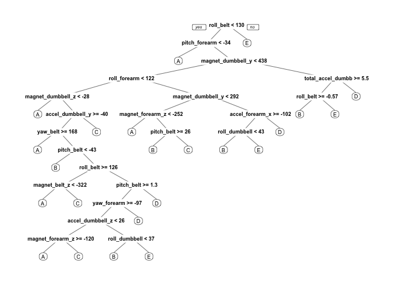

# Practical Machine Learning Course Project


## Summary
A Random Forest model with 5 fold Cross Validation was used to model a subset of the training data (70% split). The model fitted the validation training data with 98.5% Accuracy and 1.4% Out of Sample Error. This model was then used to predict the classification of the testing data set for the 5 Classes of exercise types.
The predicted results for the testing data set are as follows. These are then entered into the course Week 4 Course Project Prediction Quiz.

                           B A B A A E D B A A B C B A E E A B B B

Not all the the R code used for this exercise has been included in the Html output file. It can be found in the index.Rmd file here, https://github.com/b-mc-g/practicalmachinelearning

## Introduction
The project description from the course is repeated here for convenience.

Using devices such as Jawbone Up, Nike FuelBand, and Fitbit it is now possible to collect a large amount of data about personal activity relatively inexpensively. These type of devices are part of the quantified self movement - a group of enthusiasts who take measurements about themselves regularly to improve their health, to find patterns in their behavior, or because they are tech geeks. One thing that people regularly do is quantify how much of a particular activity they do, but they rarely quantify how well they do it. In this project, your goal will be to use data from accelerometers on the belt, forearm, arm, and dumbell of 6 participants. They were asked to perform barbell lifts correctly and incorrectly in 5 different ways. More information is available from the website here: http://groupware.les.inf.puc-rio.br/har (see the section on the Weight Lifting Exercise Dataset).

The 5 possible classes of exercising given in the data set are: 

1. Class A: exactly according to the specification
2. Class B: throwing the elbows to the front
3. Class C: lifting the dumbbell only halfway
4. Class D: lowering the dumbbell only halfway
5. Class E: throwing the hips to the front

## Raw Training and Testing Data
The training data for this project is available at:
https://d396qusza40orc.cloudfront.net/predmachlearn/pml-training.csv

The test data is available at:
https://d396qusza40orc.cloudfront.net/predmachlearn/pml-testing.csv

The data for this project come from this source: http://groupware.les.inf.puc-rio.br/har. 

The correct citation is shown in the References section.

## Loading and preprocessing the datasets

The required libraries for data processing are loaded explicitly. They are not shown here using the echo=FALSE, message=FALSE, warning=FALSE switches.


Data is downloaded using the supplied Urls and stored in a Data directory in the working directory.

The cleaning or preprocessing consists of two passes namely removing NA values and then removing predictors that are assumend to be non relevant to predicting exercise class based on the accelerometer values e.g X, window and timestamp related columns. "problem _id" column is also removed from the testing data at a later stage before the prediction begins. The results of the model application to the testing data with give the predicted "classe" values to replace the "problem_id" values later.


```r
trainingRaw <- read.csv("./Data/pml-training.csv")
testingRaw  <- read.csv("./Data/pml-testing.csv")

trainingRawC1 <- trainingRaw[, colSums(is.na(trainingRaw)) == 0] # removing NA values from data sets
testingRawC1 <- testingRaw[, colSums(is.na(testingRaw)) == 0] 

classe <- trainingRawC1$classe

trainingRemoveColumns <- grepl("^X|timestamp|window", names(trainingRawC1)) # removing not needed data columns
testingRemoveColumns <- grepl("^X|timestamp|window", names(testingRawC1)) # removing not needed data columns

trainingRawC2 <- trainingRawC1[, !trainingRemoveColumns]
trainingCFinal <- trainingRawC2[, sapply(trainingRawC2, is.numeric)]
trainingCFinal$classe <- classe

testingRawC2 <- testingRawC1[, !testingRemoveColumns]
testingCFinal <- testingRawC2[, sapply(testingRawC2, is.numeric)]
```
The training data is partitioned into a training set and a validation set using a 70/30 split
A seed value is defined to support reproducibility. A check of the number of Near Zero Values shows that the final data sets are sufficiently preprocessed.

The testing data then consists of 20 observations with 52 variables and "problem_id" in the last column and the training data 13737 and validation 5885 observations with 52 variables and "classe" in the last column.


```r
set.seed(123123) # For purposes of reproducbility, seed value can be any integer.

# Split the training data into Training and Validation sets, 70/30 respectively
inTrain <- createDataPartition(trainingCFinal$classe, p=0.70, list=F) 
trainingData <- trainingCFinal[inTrain, ]
validationData <- trainingCFinal[-inTrain, ]

# After cleaning Pass 1, C1 and pass 2, C2 check for non zero variance values
nzv <- nearZeroVar(trainingData, saveMetrics=TRUE)
if (any(nzv$nzv)) nzv else message("No variables with near zero variance training data")
```

```
## No variables with near zero variance training data
```

```r
nzv <- nearZeroVar(validationData, saveMetrics=TRUE)
if (any(nzv$nzv)) nzv else message("No variables with near zero variance validation data")
```

```
## No variables with near zero variance validation data
```

```r
nzv <- nearZeroVar(testingCFinal, saveMetrics=TRUE)
if (any(nzv$nzv)) nzv else message("No variables with near zero variance testing data")
```

```
## No variables with near zero variance testing data
```

## Modelling

Two models are applied for comparison. One using a tree classifiation and the other a Random Forest model with 5 fold cross correlation.
The accuracies and Kappa values are then compared using the Confusion Martix function in both cases to determine the model to be used for Prediction purposes.

### Decision Tree Model


```r
modelTreeClass <- rpart(classe ~ ., data=trainingData, method="class")
prp(modelTreeClass) # Decision tree for visualisation purposes. "rattle" package could not be used currently due to installation issues on a Mac.
```

<!-- -->

```r
predictmodelTreeClass<- predict(modelTreeClass, validationData, type="class")
confusionMatrix(validationData$classe, predictmodelTreeClass)
```

```
## Confusion Matrix and Statistics
## 
##           Reference
## Prediction    A    B    C    D    E
##          A 1490   48   48   62   26
##          B  239  612  127   78   83
##          C   13   47  828   69   69
##          D  112   23  158  597   74
##          E   46   59  146   63  768
## 
## Overall Statistics
##                                           
##                Accuracy : 0.7298          
##                  95% CI : (0.7183, 0.7411)
##     No Information Rate : 0.3229          
##     P-Value [Acc > NIR] : < 2.2e-16       
##                                           
##                   Kappa : 0.6569          
##  Mcnemar's Test P-Value : < 2.2e-16       
## 
## Statistics by Class:
## 
##                      Class: A Class: B Class: C Class: D Class: E
## Sensitivity            0.7842   0.7757   0.6335   0.6870   0.7529
## Specificity            0.9538   0.8966   0.9567   0.9268   0.9355
## Pos Pred Value         0.8901   0.5373   0.8070   0.6193   0.7098
## Neg Pred Value         0.9026   0.9627   0.9014   0.9447   0.9475
## Prevalence             0.3229   0.1341   0.2221   0.1477   0.1733
## Detection Rate         0.2532   0.1040   0.1407   0.1014   0.1305
## Detection Prevalence   0.2845   0.1935   0.1743   0.1638   0.1839
## Balanced Accuracy      0.8690   0.8361   0.7951   0.8069   0.8442
```
### Random Forest Model with 5 fold Cross-Validation

In order to reduce computational time,  the allowParalel is switched on and the rf method is tuned with ntree = 249 instead of the default value (believed to be currently 500).


```r
controlRandomForest <- trainControl(method="cv", 5) 
modelRandomForest <- train(classe ~ ., data=trainingData, method="rf", trControl=controlRandomForest, ntree=249, allowParallel=TRUE)
modelRandomForest
```

```
## Random Forest 
## 
## 13737 samples
##    52 predictor
##     5 classes: 'A', 'B', 'C', 'D', 'E' 
## 
## No pre-processing
## Resampling: Cross-Validated (5 fold) 
## Summary of sample sizes: 10990, 10990, 10988, 10989, 10991 
## Resampling results across tuning parameters:
## 
##   mtry  Accuracy   Kappa    
##    2    0.9914098  0.9891328
##   27    0.9901716  0.9875661
##   52    0.9823822  0.9777103
## 
## Accuracy was used to select the optimal model using  the largest value.
## The final value used for the model was mtry = 2.
```

```r
predictRandomForest<- predict(modelRandomForest, validationData) # check using the validation data 
confusionMatrix(validationData$classe, predictRandomForest) # look at the model accuracy
```

```
## Confusion Matrix and Statistics
## 
##           Reference
## Prediction    A    B    C    D    E
##          A 1672    1    0    0    1
##          B    7 1130    2    0    0
##          C    0   11 1014    1    0
##          D    0    0   13  951    0
##          E    0    0    0    0 1082
## 
## Overall Statistics
##                                           
##                Accuracy : 0.9939          
##                  95% CI : (0.9915, 0.9957)
##     No Information Rate : 0.2853          
##     P-Value [Acc > NIR] : < 2.2e-16       
##                                           
##                   Kappa : 0.9923          
##  Mcnemar's Test P-Value : NA              
## 
## Statistics by Class:
## 
##                      Class: A Class: B Class: C Class: D Class: E
## Sensitivity            0.9958   0.9895   0.9854   0.9989   0.9991
## Specificity            0.9995   0.9981   0.9975   0.9974   1.0000
## Pos Pred Value         0.9988   0.9921   0.9883   0.9865   1.0000
## Neg Pred Value         0.9983   0.9975   0.9969   0.9998   0.9998
## Prevalence             0.2853   0.1941   0.1749   0.1618   0.1840
## Detection Rate         0.2841   0.1920   0.1723   0.1616   0.1839
## Detection Prevalence   0.2845   0.1935   0.1743   0.1638   0.1839
## Balanced Accuracy      0.9977   0.9938   0.9915   0.9982   0.9995
```
The tree model accuracy is 72.9% with a Kappa of 0.657 compared to the Random forest model at 99.1% for mtry = 2 with a Kappa of 0.989 . Using the validation data the accuracy is 99.4% with a Kappa of 0.992.

We will proceed with the RF model for prediction purposes.

## Prediction of "classe" values for the original testing data set.

The accuracy of the RF model above is high and is used to predict the classe values for the training data set. Note the "problem_id" value is removed in the command line as it is not needed in this prediction step.


```r
result <- predict(modelRandomForest, testingCFinal[, -length(names(testingCFinal))]) # Predict using the original testing data set and show the result
result
```

```
##  [1] B A B A A E D B A A B C B A E E A B B B
## Levels: A B C D E
```
These values can now be entered into the course Week 4 Course Project Prediction Quiz.

# References

1. Velloso, E.; Bulling, A.; Gellersen, H.; Ugulino, W.; Fuks, H. Qualitative Activity Recognition of Weight Lifting Exercises. Proceedings of 4th International Conference in Cooperation with SIGCHI (Augmented Human '13) . Stuttgart, Germany: ACM SIGCHI, 2013.

Read more: http://groupware.les.inf.puc-rio.br/har#ixzz4iOBvD8zs

## Suggestions for further work
 * Changing ntree values to see if overfitting or underfitting is an issue.
